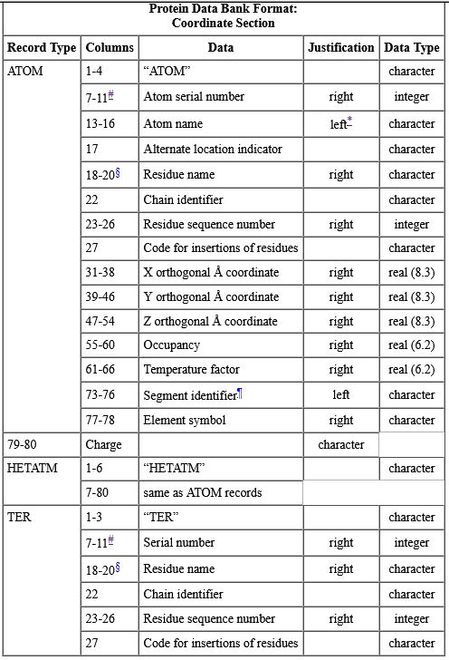

# Task-for-Automation-of-TCR-MHC-Peptide-Binding
My Solution for the Task of automation of TCR-MHC-Peptide binding

## Given Task

* From given tabular data, find all the 9bp-long synthesized peptides. 
* For each such peptide, mutate the given ligand's residues (amino acids) into the corresponding residue present in the peptide (1st residue of chain-c, mutates to 1st reside in the peptide). 
* Achieve the mutation using the chimera command 'swapaa'.
* Save the resultant structure as a PDB file. 
* Modify all the abbreviations of residues, the chain identifier and the residue sequence number in each file to “LIG”, “L”, “1” respectively.

## Solution

Given task can be simplified into two sub problems:

* Mutate the 9 residue long chain-c of the ligand.
* Apply the required modifications to the resulting pdb file.

The solution python script named ```chimera_script.py``` achieves both of the required tasks and saves the resulting files in the local directory for reference.

## Mutation Overview

The python script accesses Chimera commands using the function ```runCommand()```. 

Iterate over the sequence of residues present in the 9-bp long peptide, and for each residue, call the ‘swapaa’ chimera command with the corresponding 3-alphabet representation at the respective index. The 20 common amino acids’ mappings are coded into a *look-up* dictionary.

Example Amino-Acid Mapping : 

```python
AMINO_MAPPING = {
    'A' : 'ala',
    'G' : 'gly',
    'I' : 'ile',
    'L' : 'leu',
    'P' : 'pro',
    'V' : 'val',
    'F' : 'phe',
    'W' : 'trp',
    'Y' : 'tyr',
    'D' : 'asp',
    'E' : 'glu',
    'R' : 'arg',
    'H' : 'his',
    'K' : 'lys',
    'S' : 'ser',
    'T' : 'thr',
    'C' : 'cys',
    'M' : 'met',
    'N' : 'asn',
    'Q' : 'gln'
}
```

## PDB Format

The Protein Data Bank (PDB) format is a standardized format for files containing atomic coordinates. To apply the modifications to convert all amino acids to 'LIG', 'L' and '1', The PDB format was referenced.

[source](https://www.cgl.ucsf.edu/chimera/docs/UsersGuide/tutorials/framepdbintro.html)





## How To Run

### Running ```chimera_script.py``` :

* Open UCSF Chimera
* File -> Open -> Select ```chimera_script.py``` from local directory


## Locating the Result files : 

Result files are located in the same directory as the python script. There are two types of result files : 

* 'mutation_result_x.pdb'
* 'mutation_result_x_modified.pdb'

Results are numbered, where x is the serial number of the peptide in the reference list. Since there is only one 9 bp long peptide in the given list, the only files saved are the following : 


## Verifying the Mutation :

To verify the mutation has taken place successfully, open the first result file to view the sequence

* Open ```mutation_result_1.pdb``` using UCSF Chimera
* Select Favorites -> Sequence to display the mutated sequence


The mutated chain of the ligand can be verified through Chimera, by going through the residues, verifying its chain (C), and the sequence. 


## Verifying the Modification : 

For Step 3 of the task, the modification of abbreviations of all amino-acids to 'LIG', 'L', '1' can be verified in the following methods :

## Method 1

* Open the ```mutation_result_1_modified.pdb``` using UCSF Chimera

* Verify the existence of the one and only chain, chain 'L', by Select -> Chain -> L


* Verify the existence of the one and only residue, residue 'LIG', by Select -> Residue -> LIG


## Method 2

* Open the ```mutation_result_1_modified.pdb``` using a text editor, such as notepad

* Investigate all the 'ATOM' records, to verify that all atoms belong to the same residue 'LIG', to the same chain 'L' and to the same residue sequence '1'


## System Requirements

* [UCSF Chimera](https://www.cgl.ucsf.edu/chimera/)

## Cloning the repository

```bash
$ git clone https://github.com/eshwarprasadS/Task-for-automation-of-TCR-MHC-Peptide-binding.git
```
## Extracting the .rar file
If you have the archive file (compressed .rar file) ```Task-for-automation-of-TCR-MHC-Peptide-binding.rar```, unzip / extract the .rar file and navigate the contents as described in the [How To Run](#how-to-run) section.
## Dependencies/Libraries

> The script has no external dependencies and requires no special libraries, Chimera can run the python script as it is.

## File/Directory Structure

* ```chimera_script.py``` : contains the main code to solve the task
* ```1bd2-ligand peptide-template.pdb``` : input pdb file to apply mutation on 
* ```material for automation of TCR-MHC-peptide binding - synthesized peptides.csv``` : input reference file containing a list of peptides of varying lengths
* ```mutation_result_1.pdb``` : contains the mutated pdb file
* ```mutation_result_1_modified.pdb``` : contains the modified pdb file
* ```images/``` : directory containing reference images
